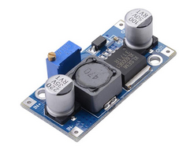

# PQP - Pot qui pense - Code Micropython - ESP8266

http://www.crepp.org/projets/pot-qui-pense/

## Librairies utilisées

Ecran oled - ssd1306
https://github.com/micropython/micropython/tree/master/drivers/display

Horloge

Convertisseur A/N

## Brochage bus et capteurs

| Libellé             | GPIO Micropython  | ESP8266 | 
| =================== | ================= | ======= |
| I2C - sda           | Pin(4)            | D2      |
| I2C - scl           | Pin(5)            | D1      |
| Thermomètre - DHT22 | Pin(12)           | D6      |
| Relais pompe        | Pin(14)           | D5      |
| Réveil alarme       | Pin(16)           | D0      |
| Bouton d'arrosage   | Pin(9)            | SD2     |

| Libellé             | Convertisseur A/N |
| =================== | ================= |
| Hygromètre terre    | A0                |
| Voltmètre batteries | A1                |

## Principe du cycle de réveil

